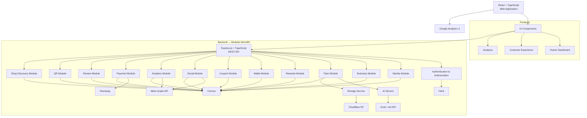
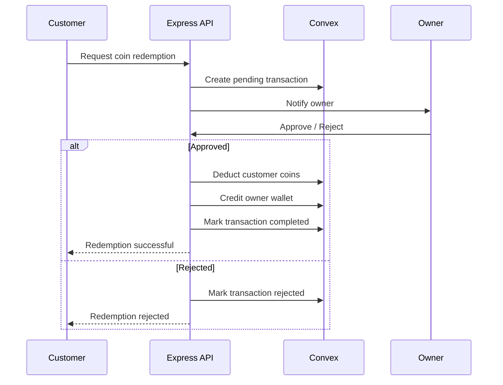
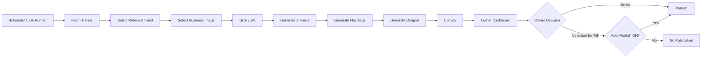
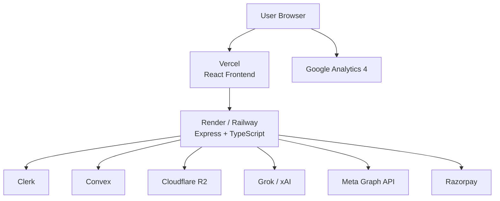
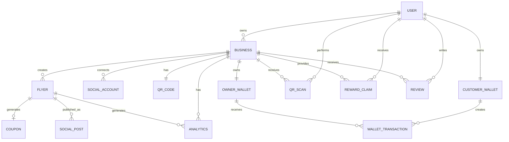

# Eddy — System Architecture

## 1. Overview

Eddy is a SaaS platform for small and medium-sized businesses that combines:

- AI-powered flyer generation
- Automatic trend-based marketing
- AI-generated hashtags
- Instagram/Facebook publishing
- Social media analytics
- Customer rewards and spin wheels
- QR-based shop interactions
- Customer wallets and coin redemption
- Flyer coupons
- Customer reviews
- Business subscriptions
- Owner analytics

The system follows a **modular monolith architecture**.

The frontend and backend are deployed independently, while the backend contains logically separated business domains.

---

## 2. Architecture Principles

1. **Modular Monolith First**
   - One Express.js backend.
   - Business functionality is separated into modules.
   - Modules communicate through services rather than directly manipulating each other's internals.

2. **API-First Backend**
   - React communicates with the backend through REST APIs.
   - Express.js is responsible for request handling, authorization, validation and business orchestration.

3. **Server-Side Business Rules**
   - Wallet balances, rewards, coupon validity, QR limits, streaks and transactions are controlled server-side.
   - The frontend must never be trusted to calculate or modify financial/reward state.

4. **External Services Behind Service Abstractions**
   - Clerk handles authentication.
   - xAI handles AI generation.
   - Meta Graph API handles social publishing and analytics.
   - Razorpay handles payments.
   - Cloudflare R2 handles flyer/image storage.

5. **Event/Job-Based Processing Where Appropriate**
   - Trend discovery, flyer generation, scheduled publishing and analytics synchronization should run asynchronously.
   - Long-running AI and social API operations should not block normal HTTP requests.

6. **Single Source of Truth**
   - Convex stores application state.
   - R2 stores binary flyer/image assets.
   - External platforms remain the source of truth for their respective social media metrics.

---

# 3. High-Level Architecture



---

# 4. Technology Stack

| Layer | Technology | Responsibility |
|---|---|---|
| Frontend | React + TypeScript | Web application and user interfaces |
| Styling | Tailwind CSS | UI styling |
| Backend | Express.js + TypeScript | REST API and business logic |
| Authentication | Clerk | Signup, login, sessions and identity |
| Database | Convex | Application data and transactional state |
| AI | Grok / xAI API | Flyer and hashtag generation |
| Social Publishing | Meta Graph API | Instagram/Facebook publishing |
| Social Analytics | Meta Graph API | Reach, engagement and comments |
| Payments | Razorpay | Business subscription payments |
| Object Storage | Cloudflare R2 | Flyer and image storage |
| QR Codes | `qrcode` npm package | Business QR generation |
| Validation | Zod | Request and response validation |
| Product Analytics | Google Analytics 4 | Product usage analytics |
| Frontend Deployment | Vercel | React application hosting |
| Backend Deployment | Render / Railway | Express API hosting |
| Version Control | Git + GitHub | Source control |
| CI/CD | GitHub Actions | Automated testing and deployment |

---

# 5. Repository Architecture

```text
eddy/
│
├── client/
│   ├── src/
│   │   ├── components/
│   │   ├── pages/
│   │   ├── layouts/
│   │   ├── hooks/
│   │   ├── services/
│   │   ├── lib/
│   │   ├── types/
│   │   ├── routes/
│   │   └── App.tsx
│   │
│   ├── public/
│   ├── package.json
│   └── tsconfig.json
│
├── server/
│   ├── src/
│   │   ├── app.ts
│   │   ├── server.ts
│   │   │
│   │   ├── config/
│   │   │   ├── env.ts
│   │   │   └── constants.ts
│   │   │
│   │   ├── middleware/
│   │   │   ├── auth.middleware.ts
│   │   │   ├── error.middleware.ts
│   │   │   ├── validation.middleware.ts
│   │   │   └── rate-limit.middleware.ts
│   │   │
│   │   ├── modules/
│   │   │   ├── identity/
│   │   │   ├── business/
│   │   │   ├── flyer/
│   │   │   ├── rewards/
│   │   │   ├── wallet/
│   │   │   ├── coupons/
│   │   │   ├── social/
│   │   │   ├── analytics/
│   │   │   ├── payments/
│   │   │   ├── reviews/
│   │   │   ├── qr/
│   │   │   └── discovery/
│   │   │
│   │   ├── integrations/
│   │   │   ├── clerk/
│   │   │   ├── xai/
│   │   │   ├── meta/
│   │   │   ├── razorpay/
│   │   │   └── r2/
│   │   │
│   │   ├── jobs/
│   │   │   ├── trend.job.ts
│   │   │   ├── flyer.job.ts
│   │   │   ├── publishing.job.ts
│   │   │   └── analytics.job.ts
│   │   │
│   │   ├── utils/
│   │   └── types/
│   │
│   ├── package.json
│   └── tsconfig.json
│
├── convex/
│   ├── schema.ts
│   ├── users.ts
│   ├── businesses.ts
│   ├── flyers.ts
│   ├── rewards.ts
│   ├── wallets.ts
│   ├── coupons.ts
│   ├── transactions.ts
│   ├── social.ts
│   ├── analytics.ts
│   └── ...
│
├── .github/
│   └── workflows/
│       ├── frontend.yml
│       └── backend.yml
│
├── docs/
│   ├── API.md
│   └── ARCHITECTURE.md
│
├── .env.example
├── .gitignore
├── README.md
└── package.json
```

---

# 6. Backend Module Architecture

Each module should follow the same internal structure.

```text
module/
├── module.routes.ts
├── module.controller.ts
├── module.service.ts
├── module.repository.ts
├── module.schema.ts
├── module.types.ts
└── module.utils.ts
```

### Responsibility of each layer

```text
Route
  ↓
Controller
  ↓
Service
  ↓
Repository / Convex
  ↓
Database
```

### Route

Defines HTTP endpoints.

Example:

```text
POST /api/flyers
GET  /api/flyers
GET  /api/flyers/:id
POST /api/flyers/:id/publish
```

### Controller

Responsible for:

- Reading HTTP request data
- Calling services
- Returning HTTP responses
- Mapping errors to HTTP status codes

Controllers should contain minimal business logic.

### Service

Contains business rules.

For example:

```text
FlyerService
    ↓
Generate flyer
    ↓
Generate hashtags
    ↓
Create coupon
    ↓
Store flyer metadata
    ↓
Return flyer
```

### Repository

Handles database operations.

The service should not contain raw database queries throughout the business logic.

---

# 7. Core Backend Modules

## 7.1 Identity Module

Responsible for:

- Owner/customer roles
- User profile
- Clerk user mapping
- Authorization
- Account status

Clerk remains responsible for authentication.

The application stores the required application-specific user information in Convex.

## 7.2 Business Module

Responsible for:

- Business registration
- Business profile
- Business category
- Business location
- Contact information
- Verification status
- Business images
- Owner settings
- Automatic publishing preference

Business type and location are also consumed by the flyer and hashtag modules.

## 7.3 Flyer Module

Responsible for:

- Automatic trend flyers
- Manual flyer generation
- Flyer drafts
- Flyer selection
- Flyer scheduling
- Flyer publishing state
- Flyer metadata
- Flyer limits
- Flyer coupons

Automatic flow:

```text
Trend
  ↓
Select Business Image
  ↓
Generate Flyer
  ↓
Generate Hashtags
  ↓
Generate Coupon
  ↓
Save Draft
  ↓
Owner Review
  ↓
Publish / Schedule
```

---

# 8. AI Architecture

The AI integration should be isolated behind an internal service.

```text
Flyer Service
      │
      ▼
AI Service
      │
      ├── Trend Context
      ├── Business Context
      ├── Image Context
      └── Flyer Context
      │
      ▼
Grok / xAI API
```

The AI service exposes application-level methods such as:

```typescript
generateFlyer()
generateHashtags()
```

The rest of the application should not directly call the xAI API.

This allows the AI provider to be replaced later without rewriting the flyer module.

---

# 9. Hashtag Generation

Hashtag generation uses:

```text
Business Type
+
Business Location
+
Flyer Topic
+
Trend
```

Example:

```text
Business:
Food Stall

Location:
Hazratganj, Lucknow

Topic:
Food / Trending Content
```

Possible generated tags:

```text
#Hazratganj
#HazratGanjLucknow
#LucknowEats
#HazratganjEats
```

---

# 10. Social Media Module

The Social module abstracts Meta Graph API.

```text
Social Module
     │
     ├── Connect Account
     ├── Store Account Metadata
     ├── Publish Post
     ├── Publish Image
     ├── Fetch Post Status
     └── Fetch Social Metrics
             │
             ▼
       Meta Graph API
```

The module should handle:

- Instagram connection
- Facebook connection
- Access token handling
- Publishing
- Post IDs
- Publishing status
- API errors
- Social account metadata

---

# 11. Social Analytics Architecture

Social analytics should be synchronized from Meta rather than calculated by the application.

```text
Meta Graph API
      │
      ▼
Analytics Sync Job
      │
      ▼
Analytics Module
      │
      ▼
Convex
      │
      ▼
Owner Analytics Dashboard
```

Possible metrics include:

- Reach
- Reactions
- Engagement
- Comments
- Performance over time
- Flyer-level performance

Actual available metrics depend on what the connected Meta APIs expose.

---

# 12. Wallet Architecture

Wallet operations are security-sensitive and must be server-controlled.

There are two wallet concepts:

```text
Customer Wallet
        │
        └── Coins

Owner Wallet
        │
        └── Rupee-equivalent balance
```

Customer rules:

```text
1 coin = ₹1
Minimum redemption = 50 coins
Maximum balance = 100 coins
```

---

# 13. Wallet Transaction Flow



---

# 14. Transaction Ledger

Wallet balances should not be the only record.

Every financial/reward operation should create an immutable transaction record.

Example:

```text
Transaction
├── id
├── type
├── customerId
├── businessId
├── amount
├── coinAmount
├── status
├── createdAt
├── approvedAt
└── metadata
```

Possible transaction types:

```text
COIN_REWARD
COIN_REDEMPTION
DISCOUNT_REDEMPTION
STREAK_BONUS
FOLLOW_REWARD
COUPON_REDEMPTION
```

This provides an audit trail for fraud prevention and settlement.

---

# 15. Rewards Module

Responsible for:

- Spin wheel
- Reward configuration
- Coin rewards
- Discount rewards
- Free-item rewards
- Reward history
- Daily QR scan limits

Example:

```text
Customer
   ↓
Scan QR
   ↓
Shop Environment
   ↓
Spin Wheel
   ↓
Reward Engine
   ├── Coins
   ├── Discount
   └── Other Reward
```

---

# 16. QR Module

Every business receives a unique QR code.

```text
Business
    ↓
Generate QR
    ↓
Encode Business Identifier
    ↓
Customer Scans
    ↓
Shop Environment
```

Example URL:

```text
https://eddy.app/shop/{businessId}
```

The QR should identify the business but should not contain sensitive information.

---

# 17. QR Scan Protection

The backend tracks QR activity.

Current rule:

```text
Maximum QR scans = 3 / customer / day
```

The frontend should display the remaining count, but the backend must enforce the limit.

```text
Request
   ↓
Authenticate Customer
   ↓
Identify Business
   ↓
Check Daily Scan Count
   ↓
If < 3
   → Record Scan
   → Continue
Else
   → Reject
```

---

# 18. Streak Module

The streak system is calculated server-side.

Rules:

```text
Eligible QR activity
        ↓
Consecutive day
        ↓
Streak +1
```

Every 10-day milestone:

```text
10 days  → +10 coins
20 days  → +10 coins
30 days  → +10 coins
```

Three consecutive inactive days reset the streak.

---

# 19. Coupon Module

Each flyer may have a one-time coupon.

```text
Flyer
  ↓
Coupon Code
  ↓
Expiry
  ↓
Customer enters code
  ↓
Verify
  ├── Business
  ├── Expiry
  ├── Status
  └── Previous Usage
  ↓
Redeem
```

Current rule:

```text
Coupon validity = 96 hours
Coupon usage = one-time
```

---

# 20. Payments Module

Razorpay handles owner subscription payments.

```text
Owner
  ↓
Checkout
  ↓
Razorpay
  ↓
Payment Success
  ↓
Webhook
  ↓
Backend
  ↓
Verify Payment
  ↓
Activate Subscription
```

The backend should rely on Razorpay webhook/payment verification rather than trusting a frontend success message.

---

# 21. Storage Architecture

Cloudflare R2 stores binary assets.

```text
React
  ↓
Express API
  ↓
R2 Service
  ↓
Cloudflare R2
```

Store in R2:

```text
/businesses/{businessId}/images/
    shop.jpg
    product.jpg
    item.jpg

/flyers/{businessId}/{flyerId}/
    flyer.png
```

Convex should store metadata such as:

```text
flyerId
businessId
storageKey
status
createdAt
```

The database should not store large binary flyer files.

---

# 22. Validation Architecture

Zod is used at the API boundary.

```text
HTTP Request
     ↓
Zod Schema
     ↓
Valid?
   /    \
 No      Yes
 ↓        ↓
400     Controller
          ↓
        Service
```

Example:

```typescript
const createBusinessSchema = z.object({
  name: z.string().min(2),
  category: z.string(),
  location: z.string(),
});
```

Zod should validate:

- Request body
- Query parameters
- Route parameters
- External API responses where useful

---

# 23. Authentication and Authorization

Clerk handles authentication.

```text
React
  ↓
Clerk
  ↓
Authenticated Session
  ↓
Express Middleware
  ↓
Verify Identity
  ↓
Application Authorization
```

Authentication answers:

```text
Who is this user?
```

Authorization answers:

```text
What is this user allowed to do?
```

Example roles:

```text
OWNER
CUSTOMER
ADMIN
```

Authorization must be enforced on the backend.

A customer must never be able to call an owner-only endpoint simply by modifying frontend code.

---

# 24. Database Architecture

Convex stores application state.

Conceptual entities:

```text
users
businesses
businessImages

socialAccounts
flyers
flyerVersions
scheduledFlyers

coupons
couponRedemptions

rewards
rewardConfigurations
rewardClaims

customerWallets
ownerWallets
walletTransactions

qrScans
streaks
streakActivities

reviews

subscriptions
payments

socialPosts
socialMetrics
analyticsSnapshots
```

Relationships:

```text
User
 ├── Customer Wallet
 ├── Owner Businesses
 └── Reviews

Business
 ├── Flyers
 ├── Coupons
 ├── Social Accounts
 ├── QR Code
 ├── Rewards
 ├── Owner Wallet
 ├── Reviews
 └── Analytics

Flyer
 ├── Images
 ├── Hashtags
 ├── Coupon
 └── Social Posts

Customer
 ├── Wallet
 ├── QR Scans
 ├── Rewards
 ├── Coupons
 ├── Streak
 └── Transactions
```

---

# 25. Automatic Flyer Processing

Automatic flyer generation should be handled as a background workflow rather than inside a normal browser request.



---

# 26. Scheduled Publishing

Scheduled publishing should be processed by a background job.

```text
Scheduled Flyer
      ↓
Convex
      ↓
Publishing Job
      ↓
Check scheduled time
      ↓
Meta API
      ↓
Publish
      ↓
Update status
```

Possible states:

```text
DRAFT
GENERATING
READY
SCHEDULED
PUBLISHING
PUBLISHED
FAILED
EXPIRED
```

---

# 27. API Architecture

Base URL:

```text
/api
```

### Identity

```text
GET    /api/me
PATCH  /api/me
```

### Business

```text
POST   /api/businesses
GET    /api/businesses/:id
PATCH  /api/businesses/:id
```

### Flyers

```text
POST   /api/flyers
GET    /api/flyers
GET    /api/flyers/:id
POST   /api/flyers/:id/select
POST   /api/flyers/:id/publish
POST   /api/flyers/:id/schedule
```

### Rewards

```text
GET    /api/businesses/:id/rewards
POST   /api/businesses/:id/rewards/spin
```

### QR

```text
GET    /api/businesses/:id/qr
POST   /api/qr/:businessId/scan
```

### Wallet

```text
GET    /api/wallet
GET    /api/wallet/transactions
POST   /api/wallet/redemptions
POST   /api/wallet/redemptions/:id/approve
POST   /api/wallet/redemptions/:id/reject
```

### Coupons

```text
POST   /api/coupons/:code/redeem
GET    /api/coupons
```

### Social

```text
GET    /api/social/accounts
POST   /api/social/connect
DELETE /api/social/:accountId
POST   /api/social/posts/:id/publish
```

### Analytics

```text
GET    /api/analytics/overview
GET    /api/analytics/flyers/:id
GET    /api/analytics/timeline
```

### Payments

```text
POST   /api/payments/create-order
POST   /api/payments/webhook
GET    /api/subscription
```

---

# 28. Request Flow

A standard request follows:

```text
React
  ↓
HTTP Request
  ↓
Express Router
  ↓
Authentication Middleware
  ↓
Authorization Middleware
  ↓
Zod Validation
  ↓
Controller
  ↓
Service
  ↓
Repository / Integration
  ↓
Convex / External API
  ↓
Service
  ↓
Controller
  ↓
HTTP Response
  ↓
React
```

---

# 29. External Integration Architecture

External APIs should not be called directly throughout the application.

Instead:

```text
Application Module
       ↓
Internal Integration Service
       ↓
External Provider
```

Examples:

```text
FlyerService
    ↓
XAIService
    ↓
xAI API
```

```text
SocialService
    ↓
MetaService
    ↓
Meta Graph API
```

```text
PaymentService
    ↓
RazorpayService
    ↓
Razorpay
```

```text
StorageService
    ↓
R2Service
    ↓
Cloudflare R2
```

This makes the system easier to test and replace.

---

# 30. Google Analytics 4

Google Analytics 4 is used for product-level analytics.

GA4 can track events such as:

```text
signup
business_created
flyer_created
flyer_selected
flyer_published
qr_scanned
spin_completed
reward_received
coupon_redeemed
wallet_redemption_requested
review_submitted
subscription_started
```

GA4 should not be treated as the authoritative source for financial transactions, wallet balances or reward state.

Those remain application data in Convex.

---

# 31. Error Handling

All backend errors should pass through centralized error handling.

```text
Controller
   ↓
Service
   ↓
Error
   ↓
Error Middleware
   ↓
Standard API Response
```

Example:

```json
{
  "success": false,
  "error": {
    "code": "COUPON_EXPIRED",
    "message": "This coupon has expired."
  }
}
```

Recommended error categories:

```text
VALIDATION_ERROR
UNAUTHORIZED
FORBIDDEN
NOT_FOUND
CONFLICT
RATE_LIMITED
EXTERNAL_API_ERROR
PAYMENT_ERROR
INTERNAL_ERROR
```

---

# 32. Security Architecture

Important security rules:

### Authentication

All protected APIs require authenticated Clerk users.

### Authorization

Every resource access must verify ownership.

Example:

```text
Owner A
  ↓
GET /businesses/B
  ↓
Backend checks ownership
  ↓
403 Forbidden
```

### Wallet Security

Never accept wallet balance or coin balance from the client.

Bad:

```json
{
  "balance": 50
}
```

Good:

```json
{
  "amount": 50
}
```

The backend calculates and validates the resulting balance.

### Coupon Security

Coupon redemption must be atomic.

The backend must verify:

```text
coupon exists
AND
coupon belongs to business
AND
coupon has not expired
AND
coupon has not been used
AND
customer is eligible
```

### QR Security

QR codes identify businesses but do not contain sensitive credentials.

### Secrets

Never expose:

```text
CLERK_SECRET_KEY
XAI_API_KEY
META_ACCESS_TOKEN
RAZORPAY_SECRET
R2_SECRET_ACCESS_KEY
```

to the React application.

---

# 33. Environment Variables

Example:

```env
NODE_ENV=development
PORT=5000
CLIENT_URL=http://localhost:5173

CLERK_SECRET_KEY=
CLERK_PUBLISHABLE_KEY=

CONVEX_URL=

XAI_API_KEY=

META_APP_ID=
META_APP_SECRET=
META_REDIRECT_URI=

RAZORPAY_KEY_ID=
RAZORPAY_KEY_SECRET=
RAZORPAY_WEBHOOK_SECRET=

R2_ACCOUNT_ID=
R2_ACCESS_KEY_ID=
R2_SECRET_ACCESS_KEY=
R2_BUCKET_NAME=
R2_PUBLIC_URL=

VITE_GA_MEASUREMENT_ID=
```

Secrets belong only in server-side environment variables.

---

# 34. Background Jobs

The architecture requires asynchronous processing for operations such as:

```text
Trend discovery
Flyer generation
Hashtag generation
Automatic publishing
Scheduled publishing
Social analytics synchronization
Subscription checks
Coupon expiration processing
```

The initial system can keep these jobs within the modular monolith rather than introducing a separate microservice architecture.

A dedicated job/worker layer can be extracted later if traffic requires it.

---

# 35. Deployment Architecture



---

# 36. Deployment Responsibilities

## Vercel

Responsible for:

- React application
- Frontend builds
- Static assets
- Frontend environment variables

## Render / Railway

Responsible for:

- Express API
- Background jobs
- External API integrations
- Server-side business logic

## Convex

Responsible for:

- Application data
- Queries
- Mutations
- Server-side persistent state

## Cloudflare R2

Responsible for:

- Business images
- Generated flyers
- Other large binary assets

---

# 37. CI/CD

GitHub Actions should run automatically when code is pushed or a pull request is opened.

```text
Developer
    ↓
Git Push / Pull Request
    ↓
GitHub
    ↓
GitHub Actions
    ├── Install dependencies
    ├── TypeScript check
    ├── Lint
    ├── Unit tests
    └── Build
    ↓
Deployment
```

Recommended checks:

```text
npm install
npm run lint
npm run typecheck
npm test
npm run build
```

Separate workflows can be used for frontend and backend.

---

# 38. Git Branching Strategy

Recommended structure:

```text
main
  │
  ├── feature/flyer-generation
  ├── feature/wallet
  ├── feature/social-publishing
  ├── feature/analytics
  └── fix/coupon-validation
```

Pull requests should be merged into `main` after required review and passing CI checks.

Production deployment should be connected to the protected `main` branch.

---

# 39. Module Dependency Rules

Modules should follow controlled dependencies.

```text
API Layer
   ↓
Business Modules
   ↓
Integration Layer
   ↓
External Services
```

A module should not directly access another module's internal repository.

For example:

```text
Flyer Module
     ↓
Social Service
```

rather than:

```text
Flyer Module
     ↓
Social Module Repository
```

This keeps module boundaries clear.

---

# 40. Core Domain Relationship



---

# 41. End-to-End Owner Flow

```text
Owner
  ↓
Clerk Authentication
  ↓
Business Registration
  ↓
Razorpay Subscription
  ↓
Business Activation
  ↓
Upload 3 Images
  ↓
Connect Instagram/Facebook
  ↓
Generate QR
  ↓
Dashboard
  ↓
Trend Detection
  ↓
AI Flyer Generation
  ↓
AI Hashtag Generation
  ↓
Coupon Generation
  ↓
Owner Review
  ↓
Publish / Schedule
  ↓
Meta
  ↓
Analytics Synchronization
  ↓
Owner Analytics Dashboard
```

---

# 42. End-to-End Customer Flow

```text
Customer
  ↓
Clerk Authentication
  ↓
Scan Business QR
  ↓
Shop Environment
  ↓
Check Daily Scan Limit
  ↓
Spin Wheel
  ↓
Reward
  ├── Coins
  ├── Discount
  └── Other Reward
  ↓
Customer Wallet
  ↓
Use Reward
  ↓
Owner Approval if Required
  ↓
Transaction
  ↓
Owner Wallet
  ↓
Customer Streak
  ↓
Review
```

---

# 43. Scalability Strategy

The initial architecture intentionally avoids unnecessary infrastructure.

```text
Phase 1
-------
React
Express
Convex
Clerk
R2
External APIs
        ↓
Modular Monolith
```

As usage increases, individual workloads can be extracted.

Potential future architecture:

```text
Frontend
    ↓
API Gateway
    ↓
Application Services
    ├── Flyer Service
    ├── Rewards Service
    ├── Wallet Service
    ├── Social Service
    └── Analytics Service
```

The initial implementation should remain a modular monolith until there is a measurable reason to introduce distributed services.

---

# 44. Recommended Separation of Responsibilities

| Responsibility | Owner |
|---|---|
| UI rendering | React |
| UI styling | Tailwind |
| Authentication | Clerk |
| Authorization | Express |
| API routing | Express |
| Business logic | Express services |
| Persistent application state | Convex |
| Flyer generation | xAI |
| Hashtag generation | xAI |
| Social publishing | Meta Graph API |
| Social metrics | Meta Graph API |
| Subscription payment | Razorpay |
| Binary storage | Cloudflare R2 |
| QR generation | `qrcode` |
| Request validation | Zod |
| Product usage analytics | GA4 |
| Frontend hosting | Vercel |
| Backend hosting | Render / Railway |
| CI/CD | GitHub Actions |

---

# 45. Architecture Summary

```text
                         ┌──────────────────────┐
                         │   React + TypeScript │
                         │       + Tailwind     │
                         └──────────┬───────────┘
                                    │
                                    ▼
                         ┌──────────────────────┐
                         │   Express.js API     │
                         │    Modular Monolith  │
                         └──────────┬───────────┘
                                    │
              ┌─────────────────────┼──────────────────────┐
              │                     │                      │
              ▼                     ▼                      ▼
        Business Modules       Reward Modules       Marketing Modules
              │                     │                      │
              └─────────────────────┼──────────────────────┘
                                    │
                    ┌───────────────┼───────────────┐
                    │               │               │
                    ▼               ▼               ▼
                 Convex           R2          External APIs
                                                  │
                         ┌────────────────────────┼───────────────┐
                         │                        │               │
                         ▼                        ▼               ▼
                       xAI                      Meta          Razorpay
```

The architecture is centered around a **React frontend + Express modular monolith + Convex data layer**, with Clerk, xAI, Meta, Razorpay and Cloudflare R2 isolated as external integrations.
